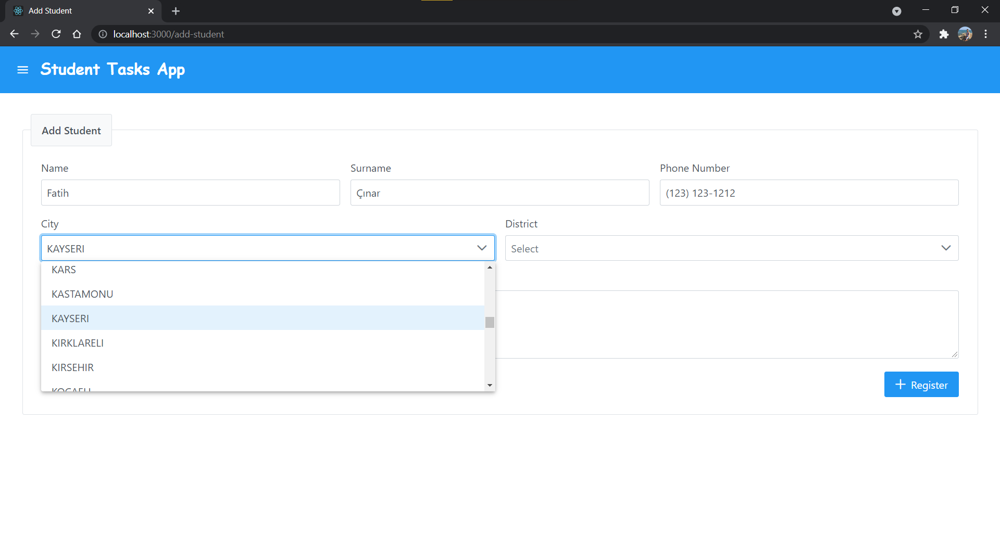
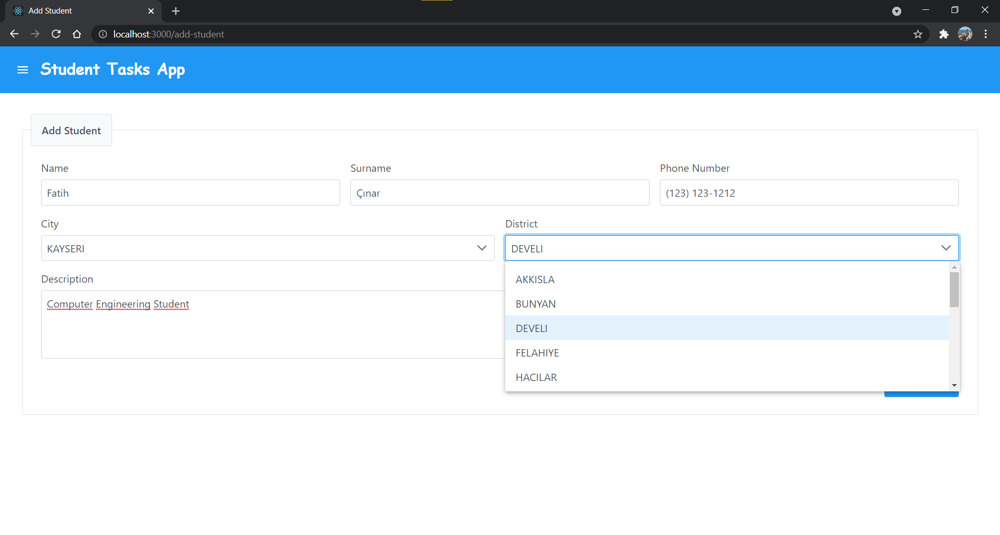
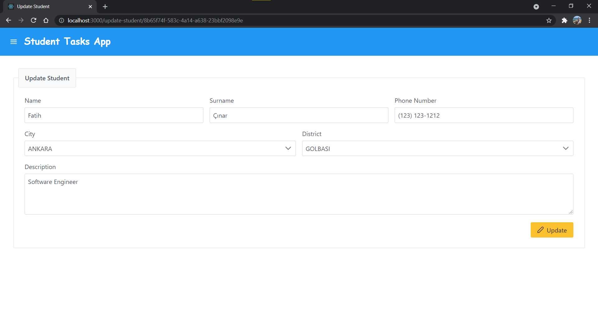

# Student Tasks

## Spring & React | CRUD Web Uygulaması

### Uygulamanın Amacı
Bu uygulamada, öğrenci kaydı listeleme, ekleme, güncelleme, silme, fotoğraf ekleme gibi özelliklerin sağlanması amaçlanmıştır. 

### Uygulama Kapsamı
Öğrenci ekleyip, güncelleyip, listeleyip, silebildiğimiz bir sistemdir. Sistemi kullanacak olan kişi, isim, soy isim, telefon numarası, şehir, ilçe, açıklama ve öğrenci fotoğrafı gibi girdileri kullanarak öğrenci oluşturabilir, dilediğinde güncelleyip, silebilir. Oluşturulan bu öğrenci kayıtlarını da listeleme özelliği ile tabloda görüntüleyebilmektedir. 

### Kullanılan Teknolojiler
```
JDK
Maven
Spring
JUnit
Mockito
React
React Hooks
PrimeReact
Axios
Docker
HSQLDB(In-Memory)
```

> <strong>Not</strong>: <code>Data Class</code> özelliğinden faydalanmak için Model, Dto ve Request dosyalarında Java yerine <code>Kotlin</code> kullanılmıştır.

### Kullanıcı Dökümantasyonu
Bu uygulamayı kullanacak kişinin kullanırken izlemesi gereken yol şu şekildedir:
1. Sistemde kullanmaya başladıktan sonra ilk olarak boş bir liste ile karşılaşacaksınız.
2. Sağ üst tarafta “Upload Image”, “Update” ve “Delete” butonlarını göreceksiniz. Lakin o butonları kullanabilmek için öncelikle sisteme öğrenci eklemeniz ve seçmeniz gerekmektedir.
3. Öğrenci ekleme ekranına geçmek için, sol üst tarafta bulunan menu tuşuna basarak yan navigasyon ekranını açıp, “Add Student” butonuna kullanabilirsiniz.
4. Öğrenci ekleme ekranına geldikten sonra, isim, soy isim, telefon numarası, şehir, ilçe ve isteğe bağlı açıklama alanlarını doldurarak sağ alt taraftaki “Register” butonuyla öğrenci ekleme işlemini gerçekleştirebilirsiniz.
5. Ardından yine menu tuşunu kullanarak yan navigasyon ekranını açıp, bu sefer “Student List” butonuyla öğrenci listeleme ekranına geçebilirsiniz.
6. Öğrenci listeleme ekranına geldiğinizde eklemiş olduğunu öğrenci kaydını görüntüleyeceksiniz. Bu kayda tıklayarak artık sağ üstteki butonları kullanabilirsiniz. İstediğiniz öğrenciye fotoğraf ekleyip, güncelleyip, o öğrenciyi silebilirsiniz.
7. Öğrenci kaydını seçtikten sonra sol üst tarafta oluşacak olan “Clear Selection” butonunu kullanarak seçme işlemini kaldırabilirsiniz. 

## Uygulama Mockup ve Prototipi

> Figma ile tasarlamış olduğum uygulamanın mockup sayfalarına bu [link](https://www.figma.com/file/BgN5sjK2UJ9KuuOCtUIZ35/Student-Tasks?node-id=0%3A1), uygulama prototipine de bu [link](https://www.figma.com/proto/BgN5sjK2UJ9KuuOCtUIZ35/Student-Tasks?node-id=1%3A127&scaling=contain&page-id=0%3A1&starting-point-node-id=1%3A127&show-proto-sidebar=1) üzerinden ulaşabilirsiniz. 

## Uygulama Ekran Görüntüleri
## Student List Sayfası
### Uygulama açıldığında karşılaşılan ilk sayfadır.

## Sidebar
### Sidebar üzerinden Student List ve Add Student sayfalarına geçiş yapabilirsiniz.

## Add Student Sayfası
### Add Student sayfasında zorunlu alanlar doldurulmadan öğrenci kaydedilmeye çalışıldığında hata ile karşılaşılacaktır.

### Sistem, City alanını doldurmadan District alanını seçtirmeyecektir.

### City alanını dolduruyoruz.

### Ardından District alanını da seçebiliyoruz.

### Zorunlu ve isteğe bağlı zorunlu olmayan alanları doldurduktan sonra kaydımızı gerçekleştirebildik.

## Student List Sayfası
### Öğrencimizi kaydettikten sonra Student List sayfasında bu şekilde listelenmektedir.

### Upload Image, Update ve Delete işlemlerini kullanabilmek için sistem, öğrenci seçmemiz gerektiği hakkında uyarı mesajı veriyor.

## Upload Image Sayfası
### Fotoğraf yüklemek istediğimiz öğrenciyi seçtikten sonra Upload Image butonunu kullanarak Upload Image sayfasına gidiyoruz.

### Choose butonunu kullanarak yüklemek istediğimiz fotoğrafı seçiyoruz.

### Fotoğraf yükleme işlemi başarılı bir şekilde gerçekleşmiştir.

## Student List Sayfası
### Seçtiğimiz öğrenciye fotoğraf ekledikten sonra Image alanı güncellenmiştir.

## Update Student Sayfası
### Güncellemek istediğimiz öğrenciyi yine seçtikten sonra Update butonunu kullanarak Update Student sayfasına gidiyoruz. City, District ve Description alanlarını değiştirelim.

### Update butonunu kullanarak öğrenci güncelleme işlemini başarılı bir şekilde gerçekleştiriyoruz.

## Student List Sayfası
### Seçtiğimiz öğrenci güncellenmiştir.

### Silmek istediğimiz öğrenciyi seçerek Delete butonuna tıklıyoruz. Sistem silme işlemini doğrulatmak isteyecektir. Yes butonuna tıklarsak eğer, seçtiğimiz öğrenci silinecektir.

### Öğrenci silme işlemi başarılı bir şekilde gerçekleşmiştir.


## Diyagramlar ve Özellikleri
## 1. Use-Case Diyagramları
### Öğrenci Listeleme Diyagramı

### Öğrenci Ekleme Diyagramı

### Öğrenci Güncelleme Diyagramı

### Öğrenci Silme Diyagramı

### Öğrenci Fotoğrafı Ekleme Diyagramı

## 2. UML Class Diyagramları


